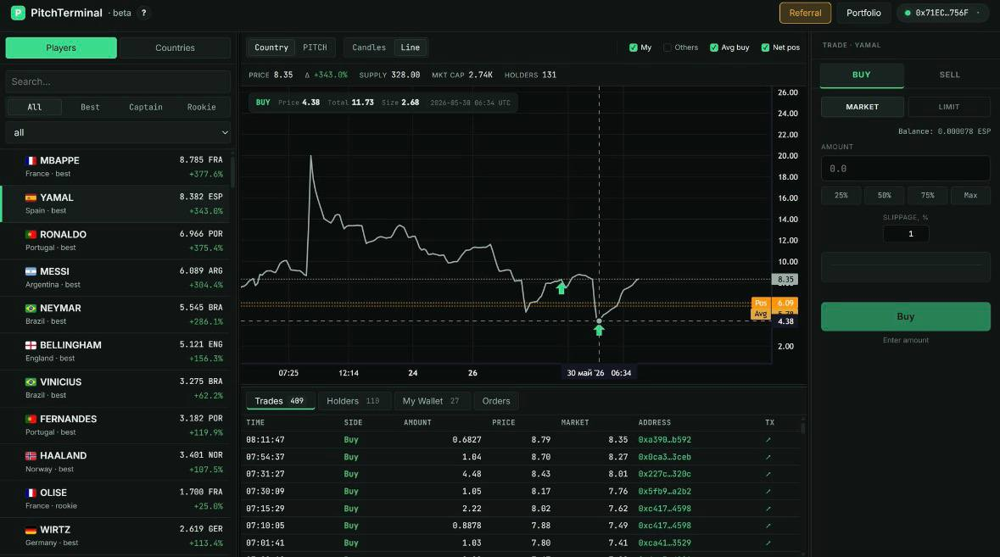

# PitchTerminal Web

A non-custodial web terminal for the player and country token markets of
[pitchwc.app](https://pitchwc.app) on Base L2.

The terminal was built for a product tied to the 2026 FIFA World Cup. The
development cycle is complete, the server has been shut down, and the app is
no longer publicly available. This repository remains available as a product
and engineering case study.



_This screenshot shows the original local prototype. The web version retained
the market-dashboard concept but replaced local private-key trading with
wallet connection, SIWE authentication, and non-custodial transactions._

## Project facts

| | |
|---|---|
| **Role** | Solo product and engineering work |
| **Development period** | May 22–June 2, 2026 — 12 calendar days |
| **Result** | Full-stack product with separate desktop and mobile interfaces |
| **Development history** | 228 commits by one author during active development |
| **Quality checks** | 94 test files; CI and automated deployment were used while the project was active |

I handled the product flow, UX, frontend, backend, smart contracts, tests,
infrastructure, and deployment. Claude was used during earlier iterations and
Codex later in the project. Generated changes were reviewed through tests and
complete user-flow checks.

## What the terminal does

- lists player and country tokens with prices, trades, and holders;
- provides search, filters, sorting, and a browser-based watchlist;
- displays line and candlestick charts across multiple timeframes;
- connects a user wallet and authenticates the session through SIWE;
- sends market trades from the browser directly to Base;
- creates and executes EIP-712 signed limit orders;
- calculates positions, realized and unrealized PnL, ROI, and portfolio
  history;
- streams price, trade, and order updates over SSE;
- manages paid access and referral rewards onchain;
- provides dedicated desktop and mobile layouts.

Users sign transactions with their own wallets. The server does not store user
private keys or take custody of user funds.

## Architecture

```text
Browser
  ├─ REST + SSE ──> Flask API ──> PostgreSQL
  └─ wallet/viem ─> Base L2

Background worker
  ├─ indexes prices and events from Base
  ├─ executes signed limit orders
  └─ stores the resulting data in PostgreSQL
```

The frontend reads market and account data through the API. Operations that
require a signature are sent to Base through the user's wallet. A separate
worker indexes onchain events and processes limit orders.

## Stack

**Frontend:** JavaScript, Vite, wagmi, viem, Reown AppKit, SIWE,
Lightweight Charts

**Backend:** Python, Flask, PostgreSQL, SQLAlchemy, Alembic, SSE

**Blockchain:** Solidity, Foundry, OpenZeppelin, EIP-712, Base L2

**Infrastructure:** Docker Compose, Caddy, GitHub Actions, Sentry

## Testing and delivery

The active project used separate checks for each application layer:

- backend: pytest, Ruff, Black, and mypy;
- frontend: Vitest, ESLint, and Prettier;
- smart contracts: Forge build, tests, and coverage;
- production deployment ran only after a successful CI run.

The test suite covers the API, SIWE authentication, portfolio and PnL
calculations, realtime streams, background workers, order execution, mobile
navigation, the trading panel, and smart contracts.

CI/CD is now disabled because the server is no longer running.

## Repository structure

```text
backend/      Flask API, PostgreSQL integration, and background worker
frontend/     Vite app, desktop/mobile UI, and wallet integration
contracts/    PitchTerminalAccess and LimitOrderExecutor
infra/        Docker Compose and Caddy
scripts/      Deployment, backup, rollback, and smoke checks
docs/         Architecture and technical specifications
```

## Documentation

| Document | Contents |
|---|---|
| [Architecture](docs/architecture.md) | System topology, component boundaries, and design decisions |
| [Functional specification](docs/functional-spec.md) | Screens, features, and user flows |
| [API specification](docs/api-spec.md) | REST and SSE contracts |
| [Database schema](docs/db-schema.sql) | Canonical PostgreSQL schema |
| [Smart contracts](docs/contracts.md) | Access payments and limit-order execution |
| [EIP-712](docs/eip712.md) | Signed order format and price calculations |
| [Runbook](docs/runbook.md) | Deployment and operations |

## Status

Development is complete. The original product had a limited operating window
connected to the 2026 World Cup, and the public server is no longer running.
The repository is not actively maintained.

## License

The source code is published for review. No open-source license is granted; all
rights are reserved.
